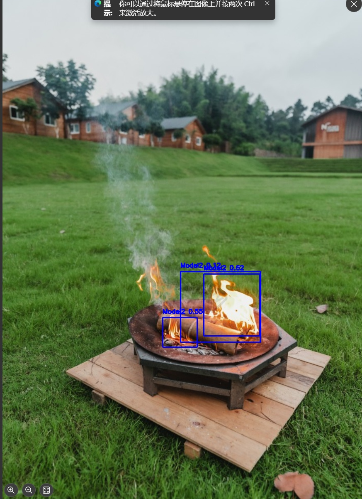
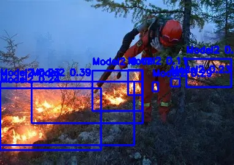

# 🔥🔥🔥基于yolov8实现的火焰/烟雾识别（支持图片和视频检测）
***
## ①Introduction
🎯配置环境：pycharm+pytorch

初次部署可以先在pycharm里配置好环境pytorch（b站有教程）并下载相应的库，之后可以先让ai生成一份训练代码，或者直接下载训练代码里的修改路径直接用

模型我都放在release里了，3个模型，表现最好的是模型2，模型3加入的psa注意力纯当练手，表现一般。三个模型我都是租云服务器上的显卡训练的，4050核显带不动，第一次用yolo_train时，可以先把数据增强和注意力机制相关的代码注释掉，不然要跑很久，第三个模型哪怕租的是409048G也要从凌晨4点跑到当晚7点

模型1是火焰/烟雾都能识别，模型2当时找数据集忘记看了，只能识别火焰

主要用到的代码是train里的yolo_train，pic_test和load_vidodata是用来输入图片或视频进行模型测试

***

## ②🔥模型介绍

✨模型1：数据集容量在6000左右，训练集占90%，验证和测试全部加起来仅10%

数据集标注的也有问题，标注基本上都分布在居中和居中左右位置，边界标注基本没有

各项指标如图，map仅0.6，而且出现了过拟合，能够识别大部分火焰场景，但是置信度偏低

    
    

## 🖼️效果展示

***

✨模型2：数据集容量达到了16000，训练，验证，测试比例为821，置信度有所提高

可以从监控曲线看出如果epoch达到120轮或许效果会更佳

各项指标如图

    
    

## 🖼️效果展示

    
    

***
✨模型3：数据集有问题，训练指标虽然比较好看但是识别火焰的能力是在不咋地就不放上来了，有兴趣可以试一下，就是训练的参数会多很多，时间也会多很多

## 总结

作为第一个深度学习的小项目，从数据集标注，打通训练环境，打通云服务，到它慢慢走上正轨，收获还是比较多的，好事多磨磨~

如果不知道数据集标注或在哪找的话可以搜label studio，kaggle，roboflow，hugging face

## ✨✨✨如果帮助到了你，请给我一颗星⑧
